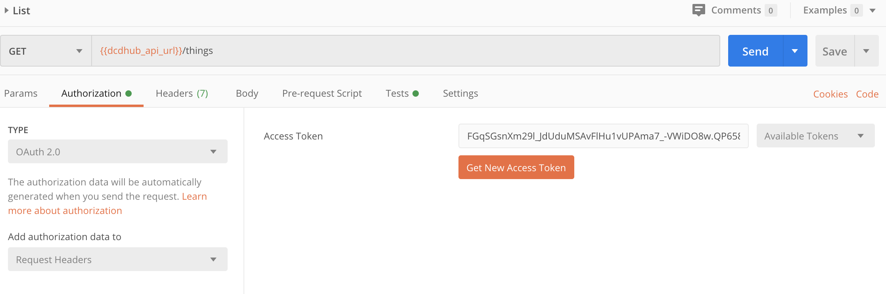
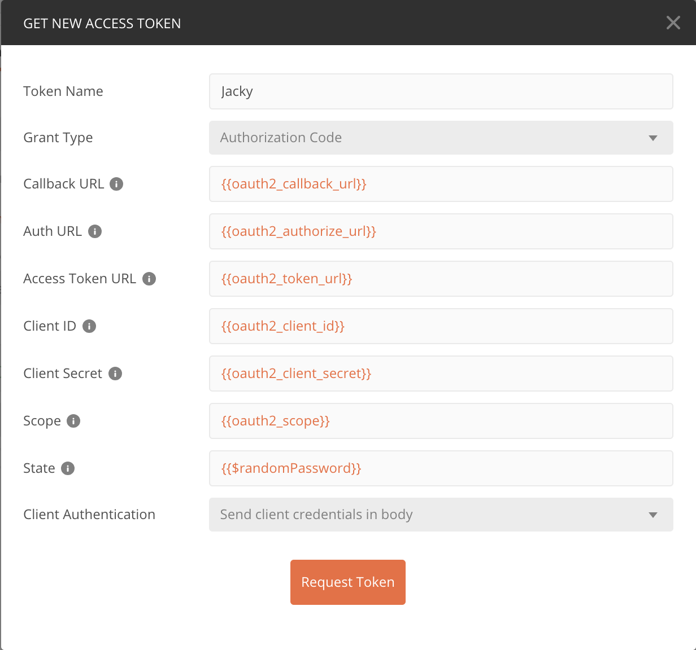

# Data-Centric Design Hub

## Local setup

First, you need to install Docker on your machine: https://docs.docker.com/install

Then, clone this repository:

```bash
git clone https://github.com/datacentricdesign/dcd-hub
```

And checkout on the develop branch.

```bash
git checkout develop
```

Run the init script to clone the repositories of all containers and set up the default environment variables.

```bash
./development/init.sh
```

Finally, boot up the dcd hub with docker-compose

```bash
cd development
docker-compose up -d
```

## Postman

To play with the hub without application, you can use Postman.

You can first import the environment variables from development/postman/postman-environment.json

In the same folder, you will find the description of all API collections.

For most APIs you will need a token. To get a token, click on the tab 'Authorization'.

Select type 'OAuth 2.0' and 'Request Headers', then press the orange button 'Get New Access Token'.



Give a name to your token, and use the environment variable to load the required params.

As Client Authentication, make sure you select 'Send client credentials in body'



Finally, press 'Request Token'. You should land on the sign in/up page (the identity provider).

Sign up and consent to the test app to get the token.

## Deployment

Deployment repository of the Data-Centric Design Hub (https://datacentricdesign.org)

Requirements:

* Install Docker

https://docs.docker.com/install/linux/docker-ce/centos/

Then, post install:

https://docs.docker.com/install/linux/linux-postinstall/

Create a folder for the system and a folder for the data.

```shell script
mkdir dcd
mkdir data
```

### Clone dcd-hub

Clone the repository and step into the directory.

```shell script
cd dcd
git clone https://github.com/datacentricdesign/dcd-hub.git
cd dcd-hub
```

Then checkout the release or the development version you are looking for.

```shell script
git checkout release/0.0.1
```

Copy and adapt the config with nano: change the host with your domain,
and choose secrets for all 'SECRET-TO-CHANGE' mention.

```shell script
cp config/default.env .env
nano .env
```

You will also need to replace the MAPS_API with your own Google Maps API to load
maps in applications.

### SSL certificate

Request a SSL certificate from your system administrator. You will need to 
 provide them with a CSR file. Then, place the provided files in /etc/ssl/certs/

- DigiCertCA.crt
- dcd-hub.crt
- dcd-hub.key
- dcd-hub.pem

## For release

```shell script
git flow release start RELEASE [BASE] 
git flow release publish RELEASE 
git flow release finish RELEASE 
git push origin --tags
```

## Adding Clients

Web app example:

```shell script
docker run --rm -it   -e HYDRA_ADMIN_URL=https://your-domain:443 \
 oryd/hydra:v1.0.0 \
 clients create --skip-tls-verify \
 --id dcd-app-data-subject  --secret  SECRET-TO-CHANGE \
 --name "DCD - Web App Example" \
 --grant-types authorization_code,refresh_token \
 --response-types token,code,id_token \
 --scope openid,offline,profile,dcd:public,dcd:things,dcd:persons \
 --callbacks https://dwd.tudelft.nl:443/subject/auth/callback \
 --token-endpoint-auth-method client_secret_post
```

Mobile app example:

```shell script
docker run --rm -it   -e HYDRA_ADMIN_URL=https://your-domain:443 \
 oryd/hydra:v1.0.0 \
 clients create --skip-tls-verify \
 --token-endpoint-auth-method none \  
 --id dcd-mobile-app \
 --name "DCD - Mobile App Example" \
 --grant-types authorization_code,refresh_token \
 --response-types token,code,id_token \
 --scope openid,offline,profile,dcd:public,dcd:things,dcd:persons \
 --callbacks nl.tudelft.ide.dcd-mobile-app:/oauth2redirect
```

## Changelog

All notable changes to this project will be documented in this file.

The format is based on [Keep a Changelog](https://keepachangelog.com/en/1.0.0/),
and this project adheres to [Semantic Versioning](https://semver.org/spec/v2.0.0.html).

### [Unreleased]

- Facilitate deployment/replication: default config

### 0.0.1 - 2019-08-19

#### Added

- Ory Hydra for OAuth2 management
- Ory Keto for Access Control Policies
- Postgres for Hydra and Keto
- Configurator for setting up Hydra, Keto and Postgres

- Apache Ambassador as proxy
- Zookeeper and Apache Kafka
- Data store MySQL and InfluxDB
- Logging with Logspout and Logstash
- Grafana

- dcd-auth for consent, login and registration
- API HTTP and MQTT
- web portals for data subjects, designers and website


